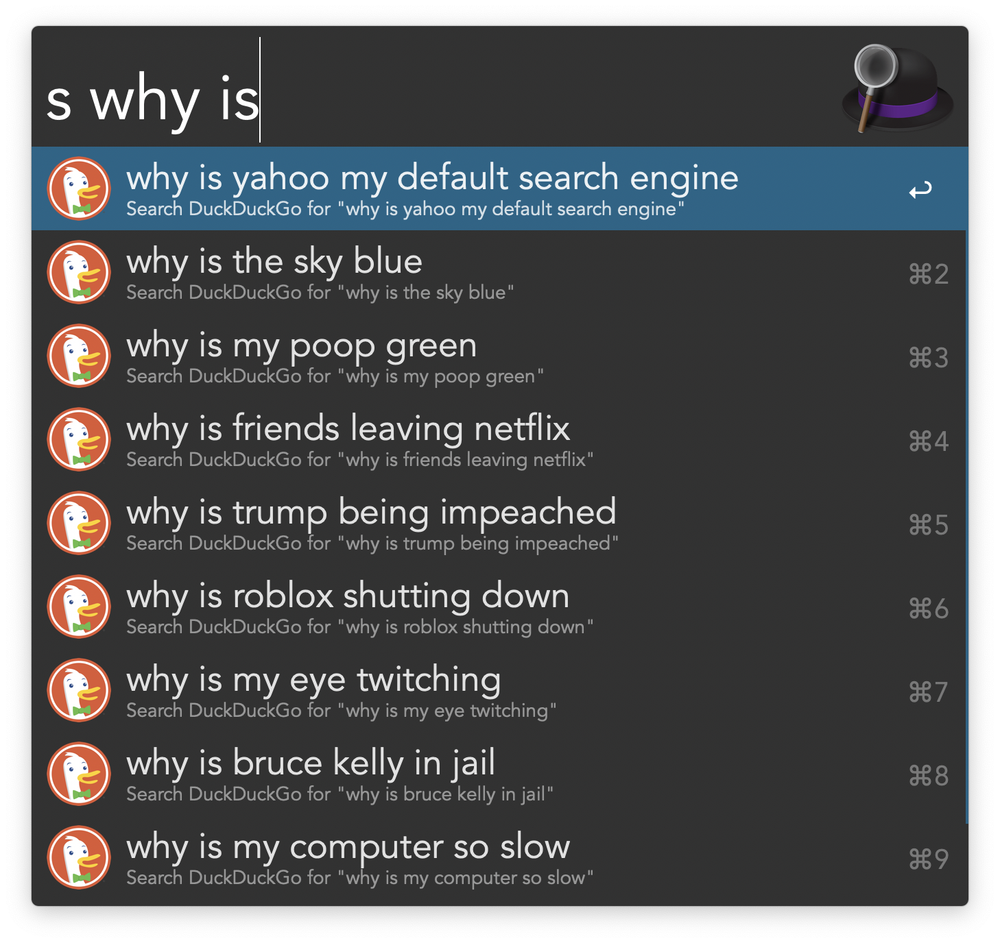

# DuckDuckGo Suggest Workflow for Alfred

An [Alfred][alfred] workflow for getting search suggestions from
[DuckDuckGo][ddg]. You need to purchase the [Alfred Powerpack][alfred-powerpack]
to use this workflow.

## Usage

1. Type the keyword `s` into Alfred followed by a search query to get search
   suggestions as you type.
2. Type <kbd>⇥</kbd> to autocomplete a search suggestion.
3. Highlight a suggestion and press <kbd>↵</kbd> to search DuckDuckGo. Press
   <kbd>⌥</kbd> + <kbd>↵</kbd> to search Google instead.

## Installing

Download the [latest release][gh-latest-release] and import it into Alfred.

## Thanks

* [DuckDuckGo][ddg]
* [Alfred-Workflow][alfred-workflow]

[alfred]: https://www.alfredapp.com
[alfred-powerpack]: https://www.alfredapp.com/powerpack
[alfred-workflow]: http://www.deanishe.net/alfred-workflow
[ddg]: https://www.duckduckgo.com
[gh-latest-release]: https://github.com/sniarn/alfred-duckduckgo-suggest-workflow/releases/latest
